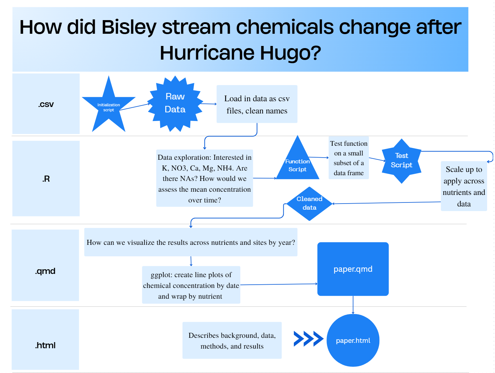

# Nutrient Levels in the Bisley Watershed (Puerto Rico) Before and After Hurricane Hugo

This repository contains raw and processed data accessed from the Environmental Data Initiative on the chemistry of stream water from the Luqillo Mountains in Puerto Rico from 1986-2020. Data from 4 sites within the Bisley watershed were analyzed to recreate Fig. 3 in Schaefer et al. 2000. The data were wrangled to create a 1 month rolling average between 1988-1994 to plot the stream nutrient levels of NO2, NH4, K, Ca, and Mg before and after Hurricane Hugo (1990).

## Documents
root: 
init_setup: contains the necessary packages to install
data_import_cleaning: contains the csv import and application of the initial rolling average function

[data](https://github.com/NatBonnet/hurricane-hugo/tree/main/data): contains the raw data accessed from EDI Docs: contains the processed data with the analysis script
[docs](https://github.com/NatBonnet/hurricane-hugo/tree/main/docs): contains the output html of paper.qmd
[figs](https://github.com/NatBonnet/hurricane-hugo/tree/main/figs): contains the outputted figure replicate of Schaefer et al. Fig 3, the flowchart that links back to README.md, and the original plot from Schafer et al. 
[R](https://github.com/NatBonnet/hurricane-hugo/tree/main/R): supporting code (functions created to calculate the rolling average and the function to apply roll_avg() across columns)
[paper](https://github.com/NatBonnet/hurricane-hugo/tree/main/paper): contains the finalized qmd
[scratch](https://github.com/NatBonnet/hurricane-hugo/tree/main/scratch): contains a test code script from the first application of the roll_avg function
### Author

Nathalie Bonnet

### Dataset Access

Public access from EDI- no special permissions were required. No data was agreggated for anonymity or data sensitivity issues.

### References

McDowell, William H., and USDA Forest Service. International Institute Of Tropical Forestry (IITF). 2024. “Chemistry of Stream Water from the Luquillo Mountains.” Environmental Data Initiative. <https://doi.org/10.6073/PASTA/F31349BEBDC304F758718F4798D25458>.

Schaefer, Douglas. A., William H. McDowell, Fredrick N. Scatena, and Clyde E. Asbury. 2000. “Effects of Hurricane Disturbance on Stream Water Concentrations and Fluxes in Eight Tropical Forest Watersheds of the Luquillo Experimental Forest, Puerto Rico.” Journal of Tropical Ecology 16 (2): 189–207. <https://doi.org/10.1017/s0266467400001358>.
